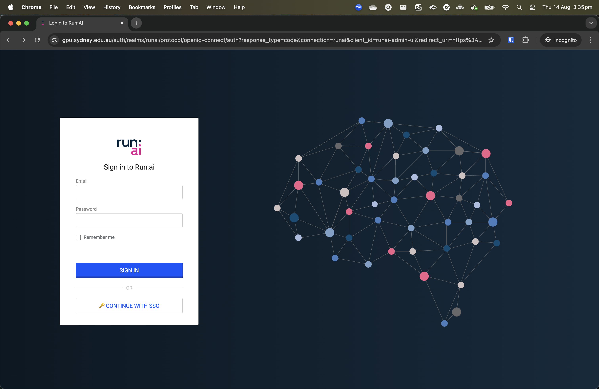
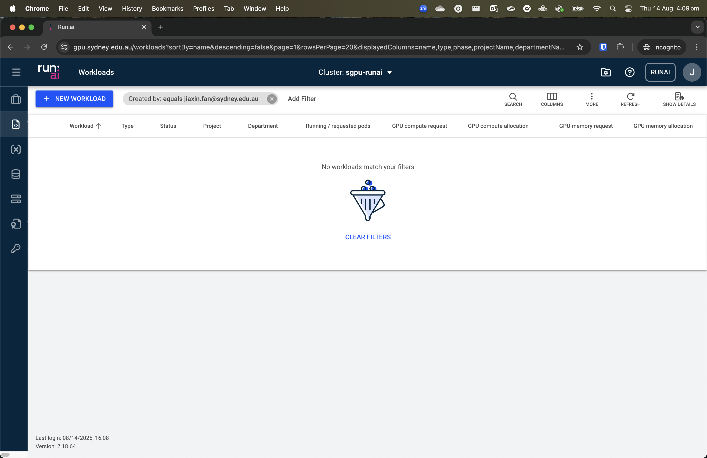

# Login
1. Go to: <https://gpu.sydney.edu.au/>. If you are not on the Sydney university network (e.g. working from home), you will need to connect to the VPN to see the login page.

2. Click “CONTINUE WITH SSO”. This will prompt you to use Okta to authenticate your login. Once the login is successful, you'll be presented with the landing (“Workloads”) page.
