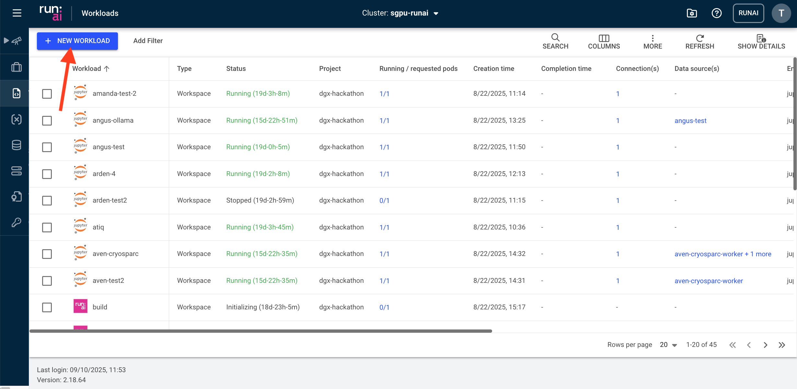
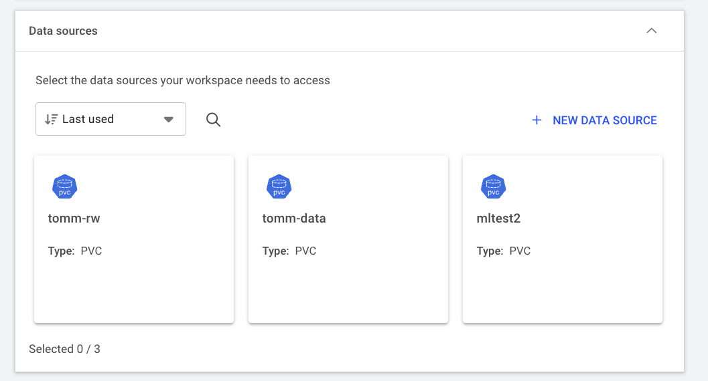
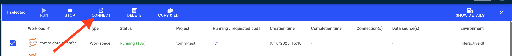
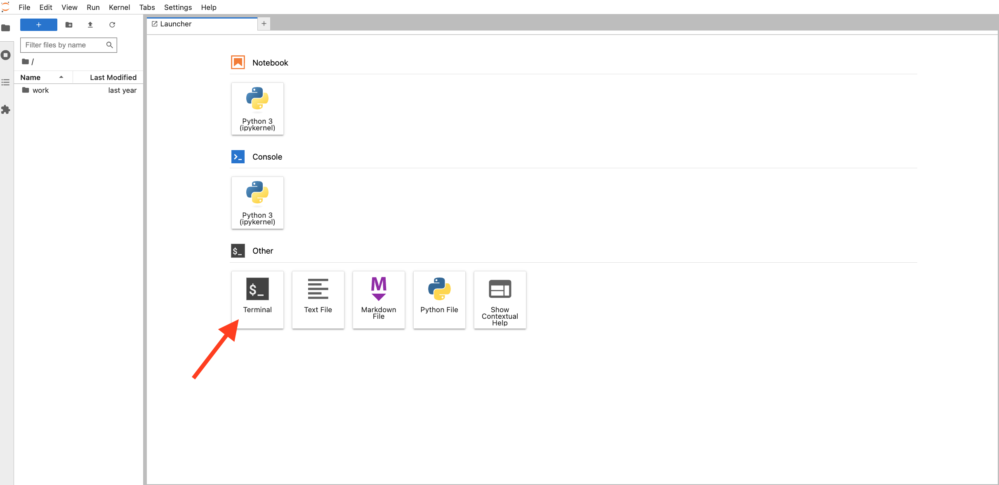

# How to transfer data to and from the Persistent volume claim

In this section we will describe methods of transferring data between the Research Data Store (RDS) and Gadi. For now, while we await the implementation of [Globus](https://sydneyuni.atlassian.net/wiki/spaces/RC/pages/3492052996/Globus+Data+Transfer) for fast and efficient transfer to and from your persistent volume claim, we will describe a simple method using a JupyterLab environment in the Run:AI web interface. In future we will include instructions for copying data using the Run:AI CLI at the command line.

Here we assume you already have set up a [project](04_projects.md) and have some [storage](06_storage.md) available within it.

## Interactive data transfer to/from RDS from a web-browser

You can easily transfer data between your Persistent Volume Claim (PVC) and RDS from inside the Run:ai web browser environment. We have set up an [environment](05_environments.md) called `interactive_dt` for you to do this.

To run the `interactive_dt` environment:

1. Log into the Run:ai dashboard at [gpu.sydney.edu.au](https://gpu.sydney.edu.au) and use okta to login with your credentials.

2. Click 'workloads' in the left panel and then the blue 'new workload' icon in the top left of the workloads screen and select 'workspace'.



3. Select your project from the projects available and select the `interactive-data-transfer` template and give your workspace a name before clicking CONTINUE.

4. If you selected the `interactive-data-transfer` template you should have pre-populated the required `interactive-dt` environment and the `data-transfer` Compute resource fields on the following page. You can double check this now.

5. Expand the `Data sources` box and select the PVC associated with your project from the list.



6. When you are happy everything is in order, click CREATE WORKSPACE and your data transfer environment will be created. When this is provisioned click the CONNECT icon above the list of workloads. 



7. You will again be prompted for your Run:ai login and your newly created JupyterLab session will appear in a new tab in your browser. Select the 'Terminal' app there.



8. In the open terminal app you can now use the rsync command to copy data to/from your project space in RDS.

To copy data from RDS to the DGX you can type the following into a the open terminal:

::: {.callout-note}
Be sure to replace everything in brackets `<` `>` with values specific to the data you are trying to copy
:::

```bash
rsync -rtlPvz --append-verify <your_unikey>@research-data-int.sydney.edu.au:/rds/PRJ-<rds_project>/<path-to-data> <mount_point>/<destination-on-DGX>
```

When you execute this command you will be prompted for your password associated with our unikey to create the connection. 

To copy data from the DGX to RDS, you just reverse the order of source and destination in the above command:

```bash
rsync -rtlPvz --append-verify <PVC_mount_point>/<path_to_data> <your_unikey>@research-data-int.sydney.edu.au:/rds/PRJ-<rds_project>/<destination-on-RDS> 
```

During file transfer, for larger files, you can close the browser and leave things running in the background. You can then reconnect to check its status by logging back into the web UI at [gpu.sydney.edu.au](https://gpu.sydney.edu.au).
    
::: {.callout-warning}
For early adopters - Until we have correct user IDs and group IDs for your unikey and project set up in the PVC and the running workflow, you will need to update the permissions oof the mounted PVC as root to be able to read/write files from there. To do this:

1. Change to root

```bash
sudo su
```

2. Use chmod to set read write for all on your PVC

```bash
chmod -R 666 <PVC_mount_point>
```

You must do these steps BEFORE running the `rsync` command above.
:::


