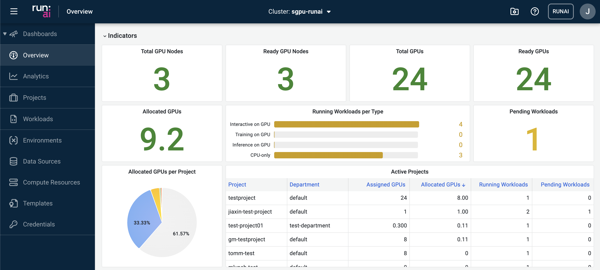
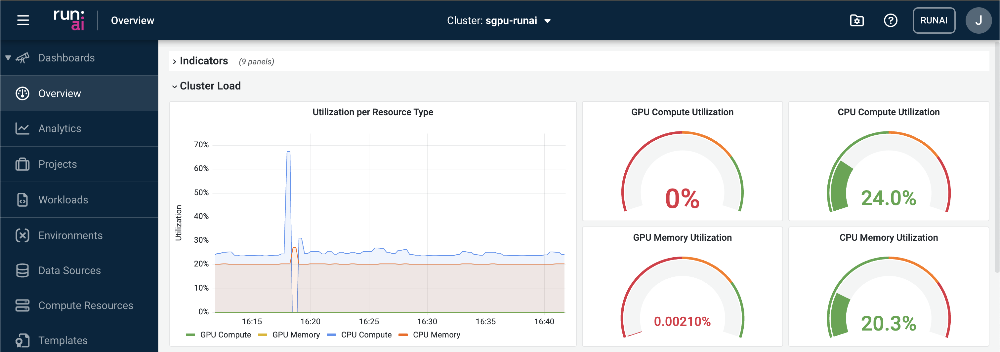
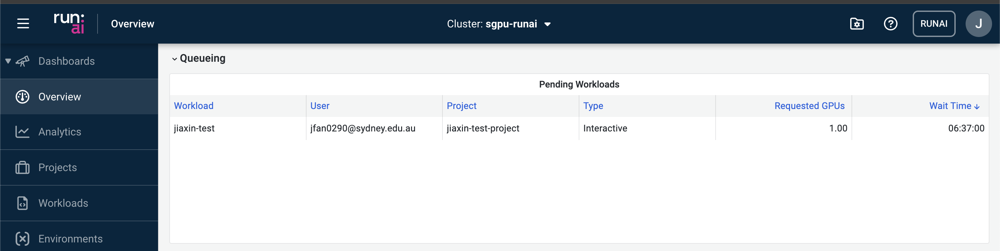
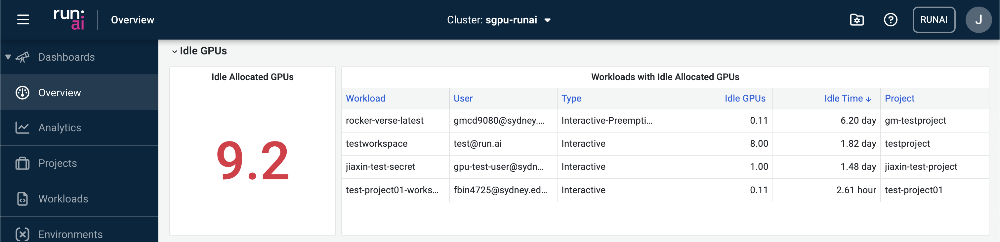
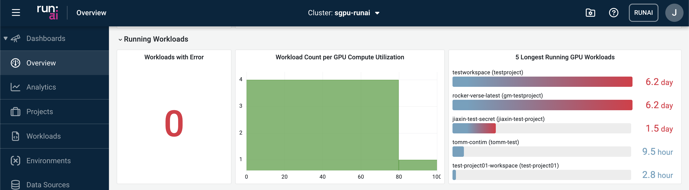
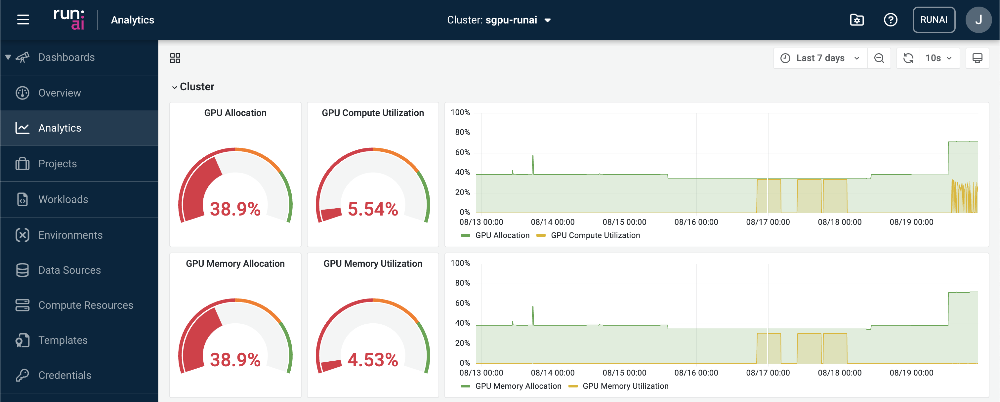

# Run:ai Dashboards
## Overview
This dashboard view provides holistic infrastructure information useful for both researchers and system administrators in managing and planning the resources.

### Indicators
This section presents high-level statistics of the GPU computing resources

### Cluster Load
Real-time monitoring of the cluster status in terms of GPU and CPU utilisation.

### Queueing
Inspecting queueing jobs. Possible reasons why your jobs are queueing include:

- The number of GPUs requested to be allocated to the job has exceeded the remaining GPU quota in the project.
- The GPU cluster is currently at full capacity and therefore has no available resources to schedule the job.
- The job is waiting for other jobs to finish before it can be scheduled.

### Idle GPUs
Displaying the number of idle GPUs currently allocated to running workloads.

### Running Workloads
Summary of the list of running workloads.

## Analytics
This dashboard provides more detailed breakdowns of the SIH GPU running status. Key
statistics that are reported at separate levels:

- Cluster
- Project
- Workloads
- Nodes

