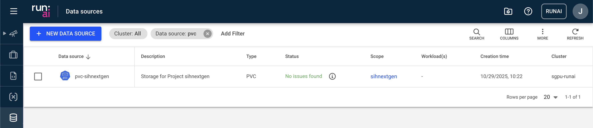

# Data Sources
Data sources in Run:ai allow you to connect additional storage systems to your Run:ai projects, enabling seamless access to datasets required for your workloads. Run:ai supports various types of data sources, including PVC ([Persistent Volume Claim](https://kubernetes.io/docs/concepts/storage/persistent-volumes/)), NFS, S3-compatible storage, and more.

When a Run:ai project is created, a default data source (PVC) is automatically set up for this project. You can find the data source under the "Data Sources", listed as `pvc-<dashr_project_shortcode>`:

This dedicated persistent storage can be accessable from any workload running within the same project. The default mount path inside the container is `/scratch/<dashr_project_shortcode>`. It is especially useful for storing intermediate results, model checkpoints, and [uploading data to the cluster](./data_transfer.md) from external sources (*e.g.* RDS).