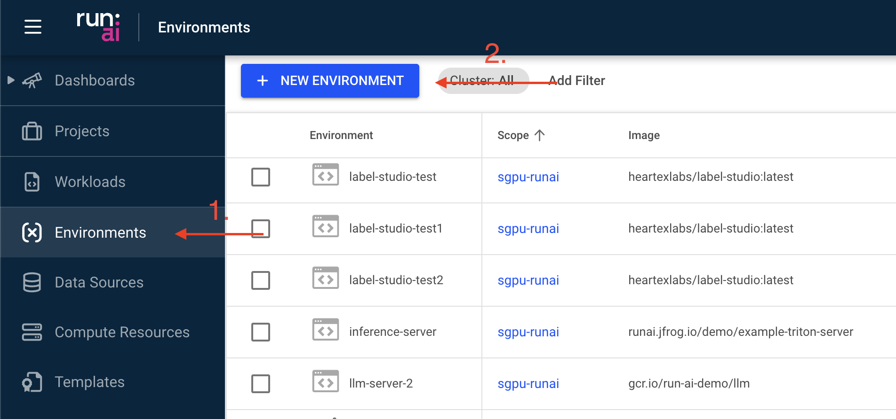
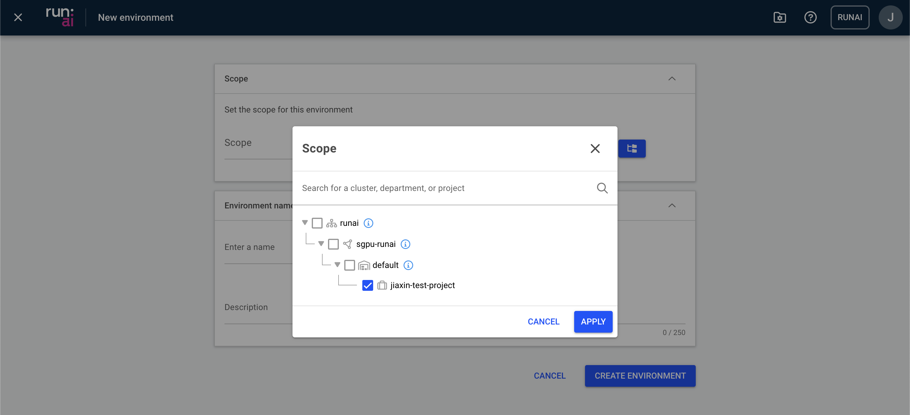
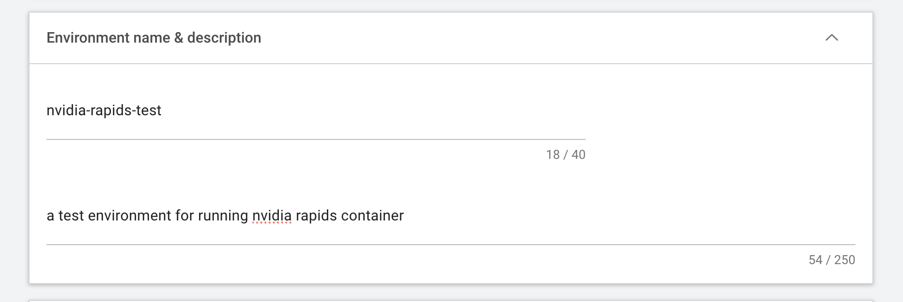
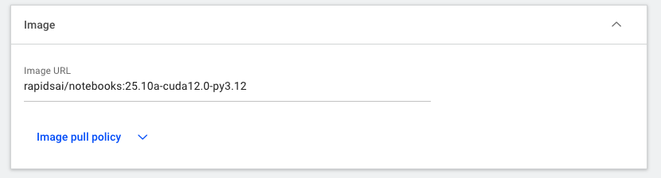
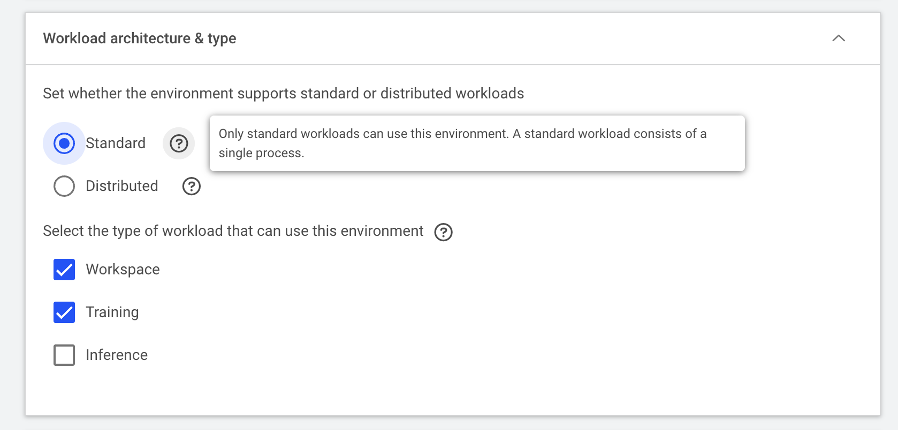
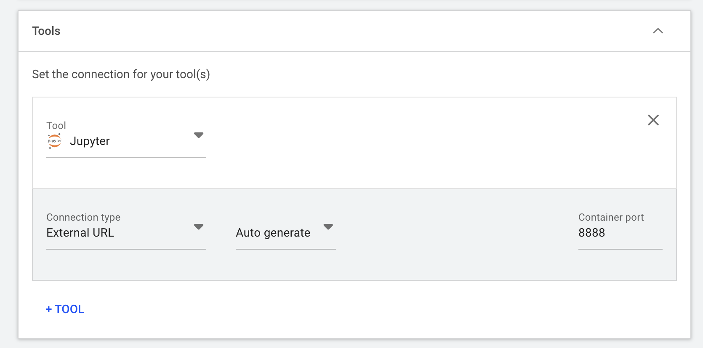
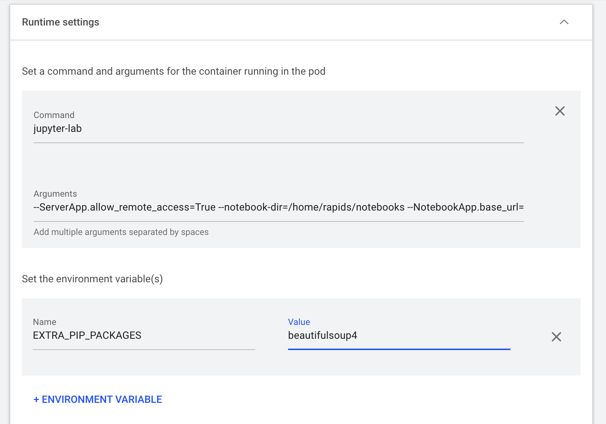
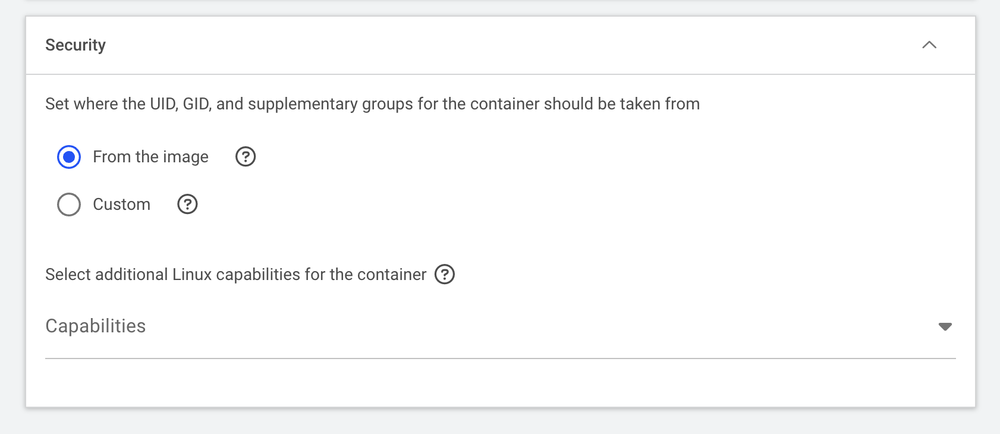

# How to Configure Environments
In Run:AI, an environment is a configuration that defines the software setup needed to run your AI workloads. An environment typically includes:

- Base Docker image (e.g., pytorch/pytorch, tensorflow/tensorflow:2.20.0-jupyter)
- Tools (such as Jupyter, RStudio, etc.)
- Custom runtime settings to run scripts or setup commands (e.g., installing extra packages, configuring the base URL, etc.)
The SIH GPU platform has provided several environments for users to get started with:

1. Select “Environments” on the left panel, then click on “NEW ENVIRONMENT”

2. In the new window, select the right scope in which the new environment should be made available

3. Provide a descriptive name and a simple description to the environment

4. Insert the URL of the docker image. In this example, we’re pulling an [NVIDIA Rapids docker image](https://hub.docker.com/r/rapidsai/notebooks) from Docker Hub with specific rapids, CUDA, and python versions: rapidsai/notebooks:25.10a-cuda12.0-py3.12

5. Specify the Workload architecture & type depending on the workload you are intending to run. Hovering over the question mark icon to see more explanation on each option

6. Select and configure the right tool used to interact with the container. For instance, the below example configures a Jupyter server to run on the
8888 container port:

7. The “Runtime settings” are also critical in correctly configuring the container when it’s up and running. You often can find such information on the container registry, github repo, or by reading through the Dockerfile. In this example, we
    a. Set the command as jupyter-lab
    b. enable the remote access of the Jupyter lab (`--ServerApp.allow_remote_access=True`),
    c. set up the notebook root directory (`--notebook-dir=/home/rapids/notebooks`),
    d. automatically populate the base url (`--NotebookApp.base_url=/${RUNAI_PROJECT}/${RUNAI_JOB_NAME}`) which is especially important to avoid the conflicts between multiple workloads using Jupyter as the front end entry
    e. disable the token authentication (`--NotebookApp.token=''`)
    f. An additional environment variable is defined to install extra dependencies (click “ENVIRONMENT VARIABLE” then enter Name as EXTRA_PIP_PACKAGES and Value as beautifulsoup4)

8. Use the default UID and GID from the image

9. Finally, select “CREATE ENVIRONMENT” to finish the setup.
