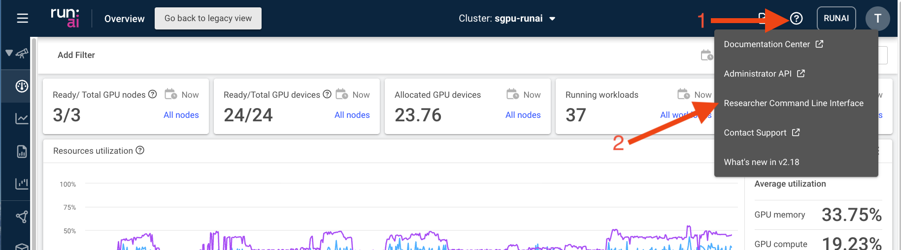
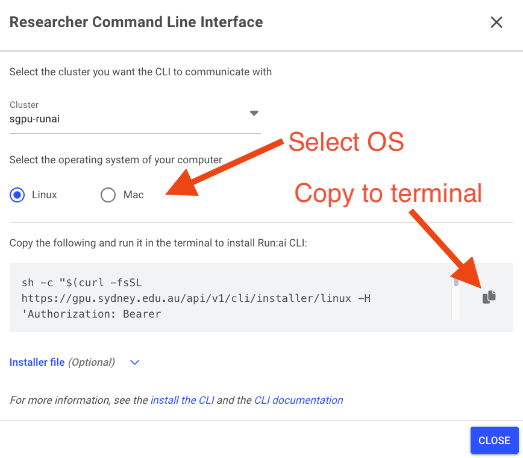

# How to Configure Environments
In Run:AI, an environment is a configuration that defines the software setup needed to run your AI workloads. An environment typically includes:

- Base Docker image (e.g., pytorch/pytorch, tensorflow/tensorflow:2.20.0-jupyter)
- Tools (such as Jupyter, RStudio, etc.)
- Custom runtime settings to run scripts or setup commands (e.g., installing extra packages, configuring the base URL, etc.)
The SIH GPU platform has provided several environments for users to get started with:

1. Select “Environments” on the left panel, then click on “NEW ENVIRONMENT”


2. In the new window, select the right scope in which the new environment should be made available


3. Provide a descriptive name and a simple description to the environment


4. Insert the URL of the docker image. In this example, we’re pulling an [NVIDIA Rapids docker image](https://hub.docker.com/r/rapidsai/notebooks) from Docker Hub with specific rapids, CUDA, and python versions: rapidsai/notebooks:25.10a-cuda12.0-py3.12


5. Specify the Workload architecture & type depending on the workload you are intending to run. Hovering over the question mark icon to see more explanation on each option


6. Select and configure the right tool used to interact with the container. For instance, the below example configures a Jupyter server to run on the
8888 container port:


7. The “Runtime settings” are also critical in correctly configuring the container when it’s up and running. You often can find such information on the container registry, github repo, or by reading through the Dockerfile. In this example, we
    a. Set the command as jupyter-lab
    b. enable the remote access of the Jupyter lab (`--ServerApp.allow_remote_access=True`),
    c. set up the notebook root directory (`--notebook-dir=/home/rapids/notebooks`),
    d. automatically populate the base url (`--NotebookApp.base_url=/${RUNAI_PROJECT}/${RUNAI_JOB_NAME}`) which is especially important to avoid the conflicts between multiple workloads using Jupyter as the front end entry
    e. disable the token authentication (`--NotebookApp.token=''`)
    f. An additional environment variable is defined to install extra dependencies (click “ENVIRONMENT VARIABLE” then enter Name as EXTRA_PIP_PACKAGES and Value as beautifulsoup4)


8. Use the default UID and GID from the image


9. Finally, select “CREATE ENVIRONMENT” to finish the setup.

## How to Run a Terminal Environment at the Command Line

You can start a workload from a terminal session on your own laptop as long as you are connected to the University VPN. This can be done using the Command Line Interface (CLI) that Run:AI provides.

### Setting up the Run:AI CLI

To set up the CLI in your terminal:

1. Log into the Run:AI web interface and select the 'Researcher Command Line Interface' from the drop-down menu under the '?' icon in the top right.



2. Select your preferred operating system and copy the command indicated in the box using the icon on the right - then paste this command into a terminal session on your local machine.



3. Follow the prompts in your terminal to set up the CLI. Once complete you should now be able to start the CLI in a terminal using `runai login` at the command line.

Once the Run:AI CLI is set up - you can start a workflow by running a saved docker image of your choice. SIH have provided base docker images with a pre-installed set of common dependencies for GPU (`sydneyinformaticshub/dgx-interactive-gpu`) and CPU (`sydneyformaticshub\dgx-interactive-cpu`) workflows on [dockerhub](https://hub.docker.com/u/sydneyinformaticshub), including basic packages for interactive use (e.g. ipython).

### Example running a GPU workflow using the CLI

1. Login to the Run:AI CLI at the command line:

```bash
runai login
```

you will be prompted for your password and Okta credentials in a browser window during this step.

2. Set your project (replace `<my project>` with the name of your project):

```bash
runai project set <my_project>
```

3. To run the `sydneyinformaticshub/dgx-interactive-gpu` container in an interactive terminal session including mounting your projects existing PVC in /scratch inside the container you can use use (be sure to replace everything in beackets `<...>` with values specific to your requirements.):

```bash
runai workspace submit <workspace-name> --image sydneyinformaticshub/dgx-interactive-gpu --gpu-devices-request 1 --cpu-core-request 1.0 --run-as-user --existing-pvc claimname=<pvc-name>,path=/scratch --attach
```

Here is a brief rundown of the arguments of the command above:

    - `runai workspace submit <workspace-name>` will run a new workspace and give it the name specified in `<workspace-name>`
    - `--image sydneyinformaticshub/dgx-interactive-gpu` will run the base Docker image located at `sydneyinformaticshub/dgx-interactive-gpu`, you can replace this image with your own, perhaps built of this image as a base
    - `--gpu-devices-request 1 --cpu-core-request 1.0` requests 1 GPU and 1 CPU for the workflow. There are multiple options for selecting GPU and CPU RAM and devices, see (here)[https://run-ai-docs.nvidia.com/self-hosted/2.22/reference/cli/runai/runai_workspace_submit] or use `runai wrkspace submit --help` for a ful list of options
    - `--run-as-user` will run the workflow using your user id and group ids inherited from DashR for your project. These will be the user and groups you are logged into the container with. You should normally use this option.
    - `--existing-pvc claimname=<pvc-name>,path=/scratch` will mount you existing PVC associated with your project into the running workload. Replace <pvc-name> with the name of your PVC. This will mount the PVC into `/scratch` inside the running container - you can change this mount point to whatever you prefer.
    - `--attach` will run the container and attach to it, which in this case will provide an interactive shell session inside it.


