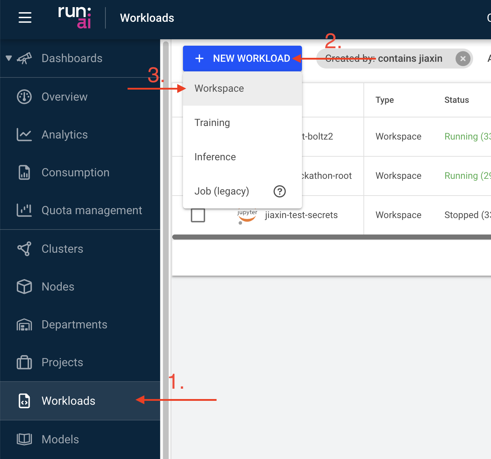
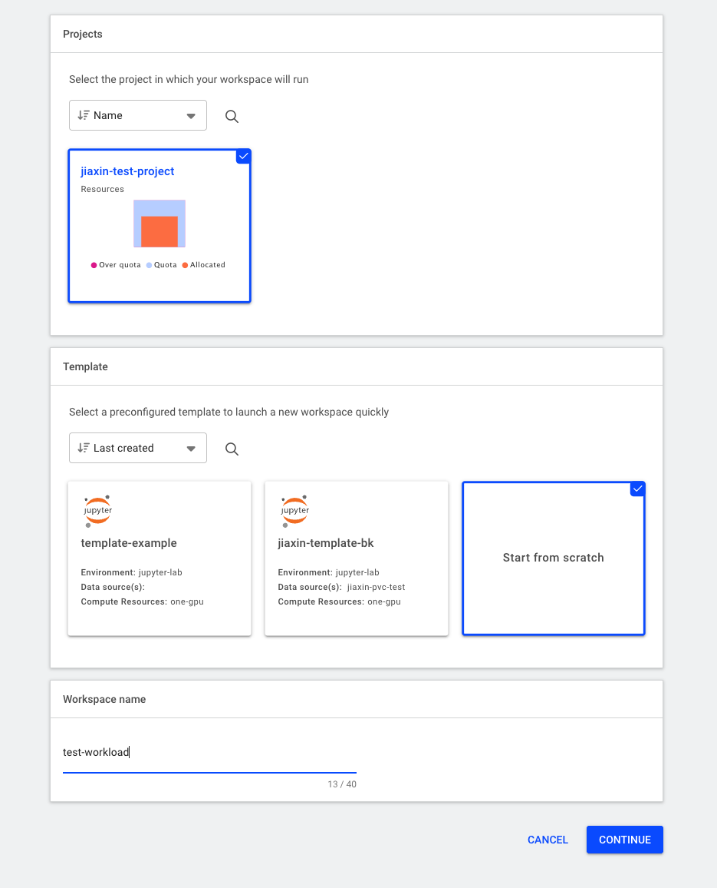
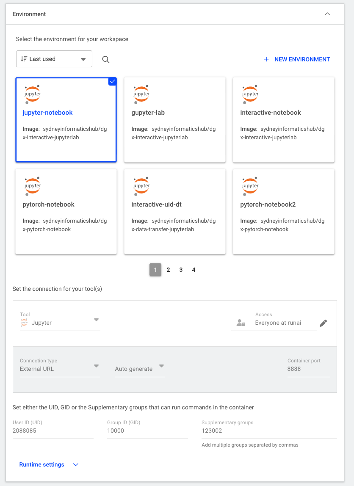
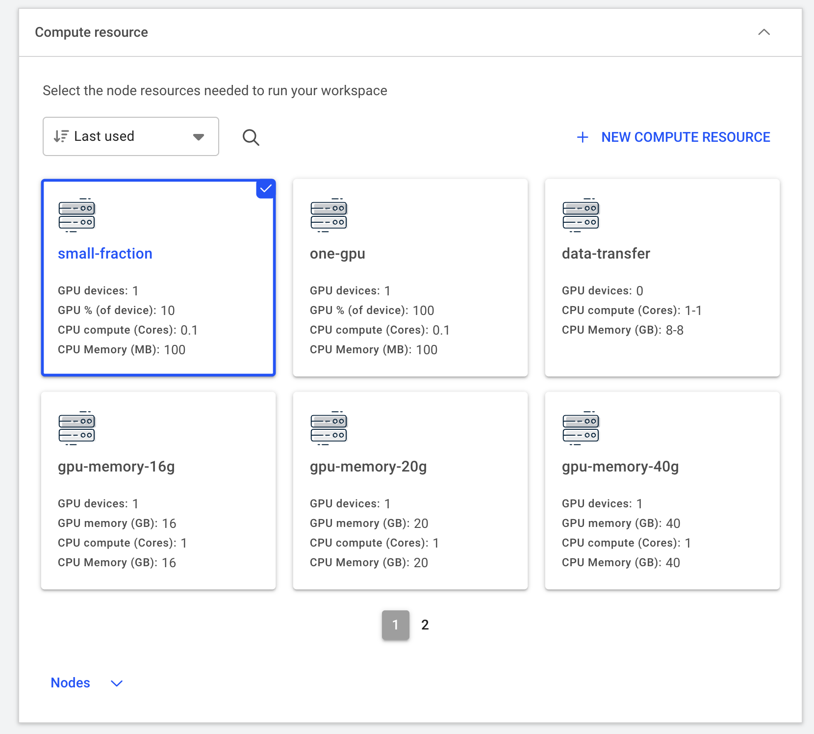
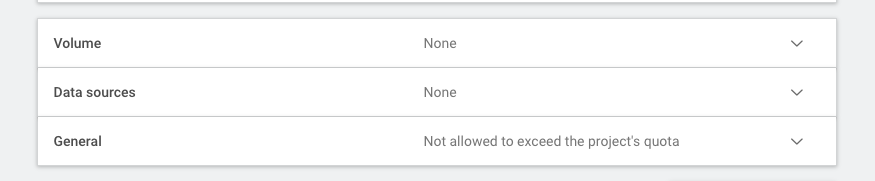

# Tutorial: Running a Jupyter Lab Workload
A workload is the actual job or task you want to run on the platform. This could be training an AI model, running inference, doing data preprocessing, or conducting a scientific simulation.

Generally, the minimum requirements you need before creating the workload include:

* Being granted permission to an active project
* An [environment](environments.md) to run such job
* Have created a data source, e.g. a PVC, to store your input and output data
* Understand the compute resources you need to run the job and have the option available under Compute Resources

In this tutorial, we will create a simple Jupyter Lab workload that allows you to run Jupyter notebooks on the platform.

## Step 1: Create a workload
Navigate to the Workloads section of the platform and click on the "NEW WORKLOADS" button. Select "Workspace" from the dropdown menu.

## Step 2: Configure the workload from scratch
Fill in the necessary details for your workload:

* the project it will be linked to
* do not use any existing template ("Start from sratch")

* the container environment it will be running

* and the compute resource required.

There are other optional components you can add to a workload depending on the needs of your task. These include:

* Volume (i.e. temporary data storage)
* Data Sources (e.g. PVCs)
* Other general settings

## Optional: Create a workload from a template
Besides the project allocation, all the other workload components can be populated from a pre-defined template:
