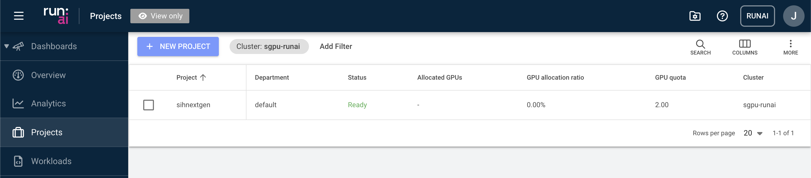

# Projects
In Run:ai, users are organised into projects. This allows users to work collaboratively and access shared resources including granted GPU hours and disk storage.

Once you have been granted access to the SIH GPU cluster, you will automatically be added to a project that shares the same name as your DashR project shortcode.

Apart from the basic information such as the number of allocated GPUs and total quota, you can also cutomise the project view. To do so, click the “COLUMNS” button and select the desired fields to display.

:::{.callout-note}
Adjusting the project settings is restricted to system administrators only. If you require any changes to the project configuration, please contact the SIH support team.
:::