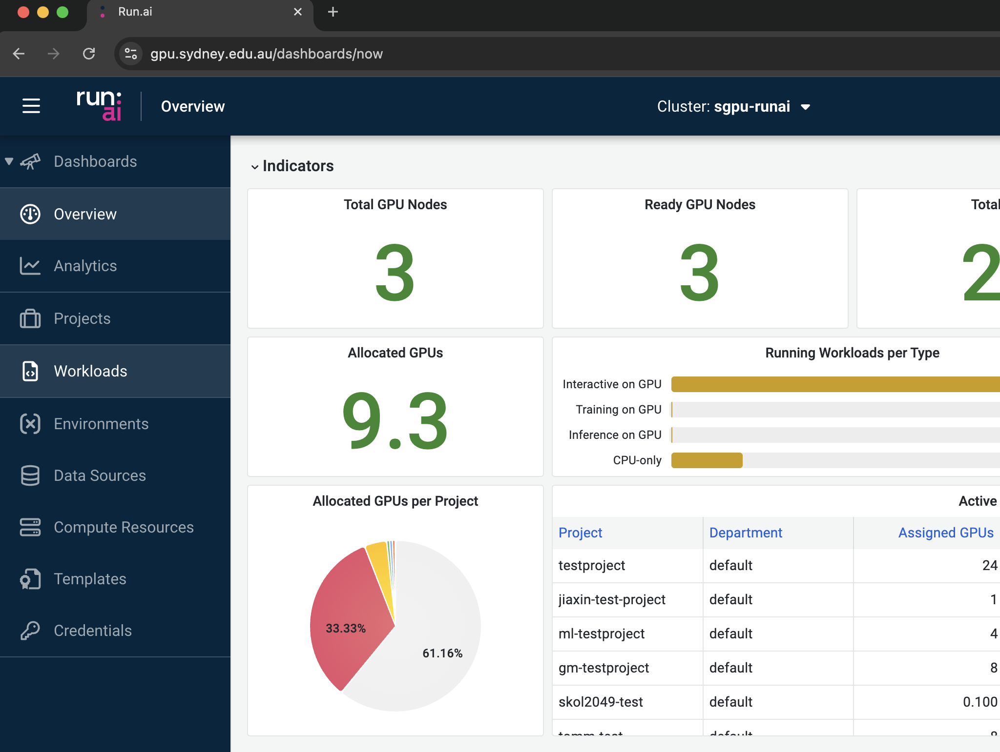

# Navigating the User Interface
The Run:ai user interface is designed to be intuitive and user-friendly, allowing users to easily access and manage their resources and workloads.

On the left panel, there are several options to select:

- **Dashboards**: Two system dashboards, namely “Overview” and
“Analytics”, are accessible to users. They provide both system- and
project-level information including system summaries, real-time
resource allocation, cluster load, etc.

- **Projects**: This lists out the projects the user has been assigned to.

- **Workloads**: This page provides a summary of the current workloads and
allows users to create and configure new workloads.

- **Environments**: Both platform-wide and customised environments can be
found in this page.

- **Data Sources**: This page allows users to configure new data sources and
view existing ones.

- **Compute Resources**: This page summaries all compute resources
(similar to choosing the “flavours” in a cloud computing environment)
and allows users to create new compute resources for their specific
needs.

- **Templates**: This feature allows users to manage bespoke templates
configured for their specific workloads.

- **Credentials**: This space allows users to define secrets including access
keys, passwords, or other sensitive information essential to the execution
of workloads during runtime.

The instructions on how to use these features will be covered in the following "Run:ai Features" section.